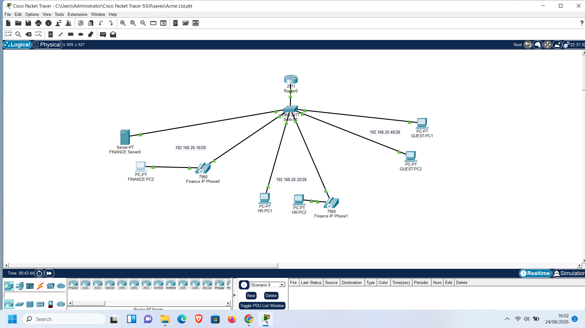

# Segmented network lab — Acme Ltd (Cisco Packet Tracer)

A small, self-contained lab project built while working through Network Defense concepts on my Cisco Networking Academy SOC Analyst track. It simulates a fictional company, **Acme Ltd**, with department-based network segmentation, inter-VLAN routing, and basic access control between departments.

## Objective

- Segment a flat network into department-based VLANs (Finance, HR, Guest)
- Route between VLANs using a single router (router-on-a-stick)
- Support VoIP with a dedicated voice VLAN
- Apply an ACL to restrict cross-department access as a basic defense-in-depth control
- Verify the design with connectivity tests

## Topology



| Device | Role |
|---|---|
| R1 (Cisco 2911) | Router-on-a-stick — inter-VLAN routing via subinterfaces, trunk to S1 |
| S1 (Cisco 2960-24TT) | Access switch — VLAN assignment, trunk uplink to R1 |
| Finance-Server0, FINANCE-PC2, Finance IP Phone0 | Finance department (VLAN 10 + voice VLAN 150) |
| HR-PC1, HR-PC2, HR IP Phone1 | HR department (VLAN 20 + voice VLAN 150) |
| Guest-PC1, Guest-PC2 | Guest network (VLAN 30) |

## Addressing plan

All subnets use /28 (255.255.255.240) blocks carved from 192.168.20.0/24 to keep addressing predictable and avoid overlap.

| VLAN | Name | Subnet | Gateway (R1 subinterface) | Usable range |
|---|---|---|---|---|
| 10 | FINANCE | 192.168.20.16/28 | 192.168.20.17 | .18 – .30 |
| 20 | HR | 192.168.20.32/28 | 192.168.20.33 | .34 – .46 |
| 30 | GUEST | 192.168.20.48/28 | 192.168.20.49 | .50 – .62 |
| 99 | MANAGEMENT | 192.168.20.64/28 | 192.168.20.65 | .66 – .78 |
| 150 | VOICE | 192.168.20.80/28 | 192.168.20.81 | .82 – .94 |

## Switch port assignment (S1)

| Port | VLAN(s) | Device |
|---|---|---|
| Fa0/1 | 10 | Finance-Server0 |
| Fa0/2 | 10 (data) + 150 (voice) | FINANCE-PC2 + Finance IP Phone0 |
| Fa0/3 | 20 | HR-PC1 |
| Fa0/4 | 20 (data) + 150 (voice) | HR-PC2 + HR IP Phone1 |
| Fa0/5 | 30 | Guest-PC1 |
| Fa0/6 | 30 | Guest-PC2 |
| Gi0/1 | trunk | Uplink to R1 (G0/0) |

Voice VLAN ports carry both a data VLAN and a voice VLAN — this is standard for a PC daisy-chained through an IP phone, where the phone tags its own traffic into the voice VLAN while passing the PC's traffic through untagged on the access VLAN.

## Router configuration (R1) — key excerpts

```
interface GigabitEthernet0/0
 description Trunk link to S1
 no ip address

interface GigabitEthernet0/0.10
 description Default Gateway for Vlan 10
 encapsulation dot1Q 10
 ip address 192.168.20.17 255.255.255.240

interface GigabitEthernet0/0.20
 description Default Gateway for Vlan 20
 encapsulation dot1Q 20
 ip address 192.168.20.33 255.255.255.240
 ip access-group GUEST_AND_HR_RESTRICTIONS in

interface GigabitEthernet0/0.30
 description Default Gateway for Vlan 30
 encapsulation dot1Q 30
 ip address 192.168.20.49 255.255.255.240
 ip access-group GUEST_AND_HR_RESTRICTIONS in

interface GigabitEthernet0/0.99
 description Default Gateway for Vlan 99
 encapsulation dot1Q 99
 ip address 192.168.20.65 255.255.255.240

interface GigabitEthernet0/0.150
 description Default Gateway for Vlan 150
 encapsulation dot1Q 150
 ip address 192.168.20.81 255.255.255.240
```

## Access control list

```
ip access-list extended GUEST_AND_HR_RESTRICTIONS
 deny ip 192.168.20.48 0.0.0.15 192.168.20.16 0.0.0.15
 deny ip 192.168.20.32 0.0.0.15 host 192.168.20.19
 permit ip any any
```

Applied inbound on both the HR (`G0/0.20`) and Guest (`G0/0.30`) subinterfaces.

| Rule | Effect |
|---|---|
| Line 1 | Blocks the entire Guest subnet (192.168.20.48/28) from reaching the entire Finance subnet (192.168.20.16/28) |
| Line 2 | Blocks the HR subnet (192.168.20.32/28) from reaching one specific Finance host (192.168.20.19) |
| Line 3 | Permits everything else — including Guest → HR, which is intentionally left open in this version |

**Design note:** this lab uses a single combined ACL applied to two interfaces, where each interface only ever matches the rule relevant to its own source subnet. A cleaner production approach would use two separate ACLs — one per interface — so each one's intent is self-contained and easier to audit. Left as-is here deliberately, as a first segmentation project; noted as a next step below.

## Testing and proof

| Test | Expected result | Screenshot |
|---|---|---|
| `show vlan brief` | VLANs 10, 20, 30, 99, 150 active with correct ports | `screenshots/vlan-brief.png` |
| `show ip interface brief` | All subinterfaces up/up | `screenshots/ip-int-brief.png` |
| Ping Guest → Finance | Fails (blocked by ACL) | `screenshots/ping-guest-finance-fail.png` |
| Ping HR → 192.168.20.19 | Fails (blocked by ACL) | `screenshots/ping-hr-host-fail.png` |
| Ping Guest → HR | Succeeds (not restricted in this version) | `screenshots/ping-guest-hr-ok.png` |
| Ping Finance → HR / Guest | Succeeds (Finance has no outbound restrictions) | `screenshots/ping-finance-ok.png` |

## Lessons learned

- In router-on-a-stick, IP addresses belong on the subinterfaces, not the physical interface — the physical interface just carries the trunk.
- A `255.255.255.192` (/26) mask threw a "bad mask" error when I tried to assign the network address itself as a host IP — a reminder that the network and broadcast addresses in any block are never usable as interface addresses.
- /28 blocks (16 addresses each) gave enough headroom for five VLANs without any overlap or wasted planning time.
- Applying one shared ACL to two interfaces works, but writing two separate, single-purpose ACLs would have been clearer for anyone auditing the config later.

## Next steps

- Split `GUEST_AND_HR_RESTRICTIONS` into two dedicated ACLs, one per interface
- Add `deny` logging to the ACL for visibility into blocked attempts
- Extend HR's restriction from a single host to the full Finance subnet, if that turns out to be the intended policy
- Revisit with a Layer 3 switch and VLSM once available, instead of router-on-a-stick

## Author

Documented as part of my journey toward a Tier 1 SOC Analyst role — Business IT graduate building hands-on networking and defense skills through Cisco Networking Academy.
